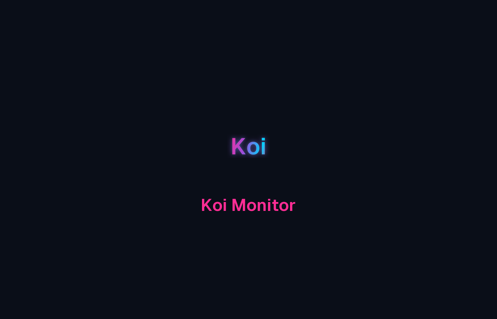

<div align="center">

# 🌸 Koi Monitor

### *Votre PC, enfin lisible. Beau. Léger. Fiable.*

**L’application Windows qui surveille votre ordinateur** — sans ressembler à un outil technique des années 2000.

<br />


<br />

<!-- Ajoutez une capture d’écran ici pour GitHub -->
<!--  -->

*Design moderne · Effet verre · Thème sombre & clair · Ambiance sakura*

<br />

[Pourquoi Koi](#-pourquoi-koi) ·
[Interface](#-une-interface-qui-fait-envie) ·
[Léger & rapide](#-léger-et-discret) ·
[Fiable](#-des-infos-en-lesquelles-vous-pouvez-croire) ·
[Fonctionnalités](#-ce-que-vous-pouvez-faire) ·
[Installation](#-installation)

</div>

---

## 🎐 Pourquoi Koi

Vous connaissez ces logiciels de monitoring : chiffres partout, fond gris, courbes illisibles, et l’impression d’avoir ouvert le panneau de configuration Windows.

**Koi Monitor**, c’est l’autre option.

Une app **claire, colorée, agréable à regarder** — qui vous dit ce qui compte vraiment : est-ce que mon PC va bien ? Est-ce que ma connexion tient la route pour jouer en ligne ? Ai-je un pilote à mettre à jour ?

Pas de jargon inutile. Pas de fausses alertes pour vous faire peur. Juste **votre machine, expliquée simplement**.

---

## ✨ Une interface qui fait envie

Koi Monitor, ce n’est pas « un moniteur avec un joli thème ». C’est une **vraie expérience visuelle**, pensée comme une app moderne — pas comme un utilitaire caché dans le menu Démarrer.

### Ce qui change au quotidien

| Vous voyez… | Et ça vous sert à… |
|-------------|-------------------|
| 🩷 **CPU** en rose néon | Savoir si votre processeur est sous pression — avec un graphique et la vue par cœur |
| 🔵 **RAM** en cyan | Comprendre combien de mémoire est vraiment utilisée |
| 🟣 **GPU** en violet | Suivre votre carte graphique, la VRAM et la charge en jeu |
| 🩵 **Réseau** en turquoise | Voir le débit en direct, Wi‑Fi ou câble Ethernet |
| 🟢 **DNS & Jeu** en vert | Choisir le meilleur DNS **et** savoir si vous êtes prêt pour le multijoueur |

### Le petit plus qui fait la différence

- **Cartes en verre dépoli** — élégantes, lisibles, activables ou non selon vos goûts
- **Pétales de sakura** en arrière-plan — ambiance zen, réglable (ou désactivable)
- **Animation d’ouverture** — le titre se découpe au lancement, comme une signature
- **Thème clair ou sombre** — les deux restent confortables à l’œil, même en plein jour
- **Barre du haut** — un coup d’œil suffit : CPU, RAM, GPU, latence jeu, temps depuis le démarrage

> En résumé : **beau à garder ouvert**, pas seulement utile une fois par mois.

---

## ⚡ Léger et discret

Un moniteur système ne devrait **pas** être celui qui ralentit votre PC en permanence.

Koi Monitor est conçue pour **peser peu** et **consommer peu** au quotidien :

| | Koi Monitor | Beaucoup d’apps « modernes » |
|--|-------------|------------------------------|
| **Espace disque** | ~10–25 Mo | Souvent 150 Mo et plus |
| **Mémoire au repos** | ~80–150 Mo | Souvent bien plus |
| **En veille** | Très faible | Variable |

**Concrètement :** vous pouvez la laisser tourner en fond pendant que vous travaillez, streamez ou jouez — sans sentir qu’une deuxième application lourde tourne à côté.

### Mode Zen 🌸 — quand vous voulez du calme

Un clic sur la fleur de cerisier, et le dashboard disparaît :

- **Grande horloge** + date en français
- **Citation** qui s’adapte à la charge de votre PC
- **L’essentiel** : CPU, RAM, GPU, latence jeu, protection antivirus
- **Moins d’animations** — l’app se met en retrait pour ne pas distraire

Idéal sur un second écran, en session focus, ou juste parce que vous préférez la sobriété.

---

## 🛡️ Des infos en lesquelles vous pouvez croire

Une belle interface ne suffit pas si les chiffres mentent ou inquiètent pour rien.

### Ce sur quoi on insiste

- **Données directement depuis Windows** — pas de chiffres inventés ou approximatifs
- **Latence jeu ≠ test DNS** — deux mesures différentes, deux usages différents (on ne mélange pas « ping DNS » et « est-ce que je peux jouer en ranked »)
- **Pilotes : mode honnête** — « Installé », « À vérifier », « Mise à jour dispo » ; pas de fausse alerte « votre PC est obsolète »
- **Mises à jour pilotes** — on vous envoie d’abord vers **Windows Update**, le canal officiel ; les liens constructeur restent en secours
- **Liens externes sécurisés** — seuls les sites reconnus (NVIDIA, AMD, Intel, Microsoft…) sont proposés

### En cas de souci

Si un test réseau ou un scan pilote échoue, **un message clair** s’affiche en bas de l’écran — pas un écran blanc ou une erreur cryptique.

L’application démarre aussi **même si un scan prend du temps** (jusqu’à ~90 secondes au pire) : pas bloqué sur un écran de chargement infini.

---

## 🧩 Ce que vous pouvez faire

### 📊 Surveiller votre PC en direct

- Processeur, mémoire, carte graphique, réseau
- Graphiques d’historique pour voir l’évolution
- Vue détaillée des cœurs CPU (mode « égaliseur »)
- Connexion active : **Wi‑Fi** ou **Ethernet**, affichée clairement

### 🌐 Trouver le meilleur DNS

- Compare Google, Cloudflare, Quad9, OpenDNS en un clic
- **Test auto** — les 4 recommandés, immédiatement
- **Personnaliser** — choisissez vos serveurs dans les paramètres
- Verdict simple : latence excellente, bonne, moyenne ou critique
- Le gagnant est marqué d’une couronne ⚜️

### 🎮 « Prêt pour le jeu ? »

Avant de lancer une partie en ligne :

- Un **badge** vous dit si la connexion est OK (`Prêt pour le jeu`, `Limite ranked`, `Problème box / Wi‑Fi`…)
- **Un clic** ouvre le détail : votre box, internet, stabilité (jitter)
- Disponible sur le **dashboard** et en **mode Zen**

### 🔧 Pilotes — l’essentiel, sans prise de tête

- **Mode simplifié (par défaut)** : 3 pilotes clés — GPU, réseau, Bluetooth
- **Mode étendu** : tout le matériel important (compte ~1–2 min de scan)
- Comparaison **version installée vs disponible**
- Bouton **Ouvrir Windows Update** quand une mise à jour officielle existe
- Liens constructeur si besoin — sans promesse d’installation magique en un clic

### 🌸 Mode Zen

- Horloge, date, citation, état du PC (repos / modéré / intense)
- Statut antivirus : **Protégé · [nom du logiciel]** ou alerte si rien n’est détecté
- Touche **Échap** ou bouton pour revenir au dashboard

---

## 🚀 Installation

### Vous voulez juste l’utiliser

1. Récupérez **`koi-monitor.exe`** (build local ou fichier partagé)
2. Copiez-le où vous voulez et double-cliquez
3. C’est tout — **pas besoin d’installer Node.js, Rust ou quoi que ce soit d’autre**

**Compatible :** Windows 10 ou 11 (64 bits). WebView2 est en général déjà présent sur Windows 11 ; sur Windows 10, installez-le via Windows Update ou Microsoft Edge si l’app ne démarre pas.

### Vous voulez compiler vous-même

<details>
<summary><strong>Développeurs — cliquez pour développer</strong></summary>

```powershell
cd koi-monitor
.\setup.bat    # Admin — première installation
.\dev.bat      # Lancer en mode développement
.\build.bat    # Créer koi-monitor.exe (sans setup MSI/NSIS)
```

Prérequis : Node.js 20+, Rust, WebView2.

</details>

---

## 💻 Prérequis

| | |
|--|--|
| **Système** | Windows 10 ou 11, 64 bits |
| **Internet** | Recommandé (tests DNS, latence, pilotes) |
| **Compte** | Utilisateur standard suffit dans la plupart des cas |
| **Entreprise** | Certains PC verrouillés peuvent limiter les scans avancés |

---

## 🔒 Vie privée & sécurité

- Application **locale** — vos métriques restent sur votre machine
- Tests réseau limités aux **serveurs que vous choisissez** (DNS) ou aux cibles de latence jeu (box, Cloudflare)
- Pas d’installation de pilote à votre place : **vous gardez le contrôle** via Windows Update ou le site du constructeur
- Logiciel open source (licence **MIT**)

---

## 📄 Licence

**MIT** — Katana © 2026  
Libre d’utilisation, modification et partage.

---

<div align="center">

### 🌸 Koi Monitor

*Comprendre son PC ne devrait pas être un corvée.*  
*Léger. Beau. Fiable.*

<br />

**[⬆ Retour en haut](#-koi-monitor)**

</div>
